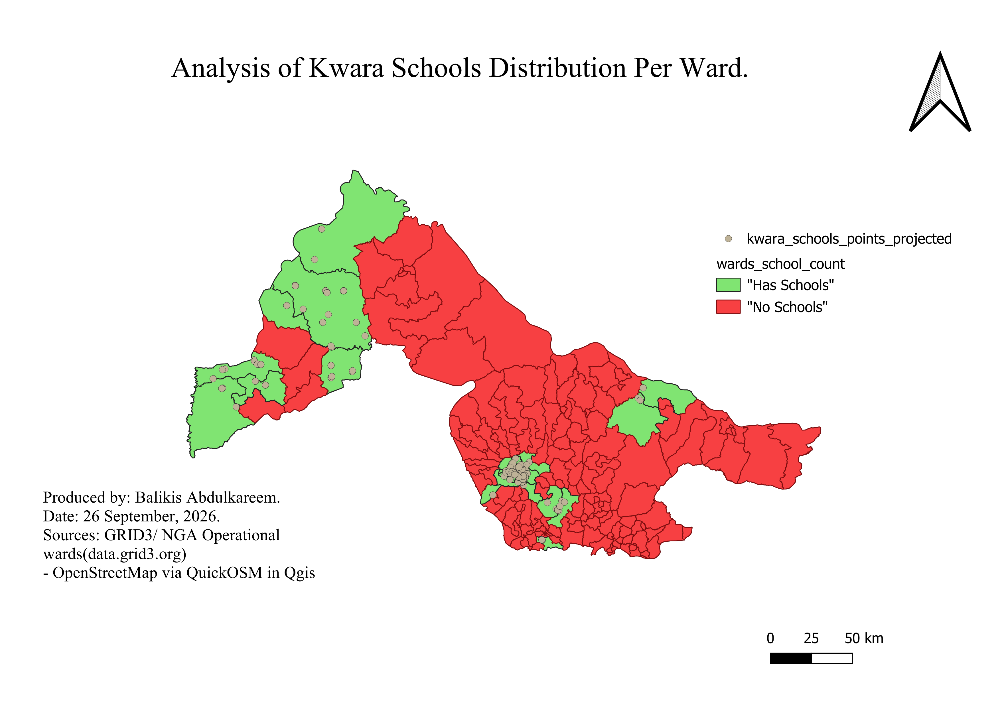

# Kwara Schools Coverage Analysis.
Mapping OSM school coverage across kwara state, Nigeria, by ward to identify which wards are underserved and where mapping gaps exist.

## The Question
>Where are schools actually located across Kwara state, and how complete is OSM coverage of them by ward? 

## What is in here

```
project name/
  
└───docs/
        01-project-brief.md       week 1
        02-data-notes.md          week 2
        03-data-preparation.md    week 3
        04-month-1-summary.md     week 4 
└───data/   
    └───raw/
downloads, not committed.    
  └───processed/
Not committed
```
The data is not in this repository. Every source is linked in the project, so anyone can fetch it.

## Progress
- [x] Week 1, project brief with a siurce link for every datatset.
- [x] Week 2, data downloaded, opened and described.
- [x] Week 3, reprojected, clipped and quality checked.
- [x] Week 4, first spatial analysis, checked four ways.

---


Balikis Abdulkareem - GeoDev Lab Africa.

Learn. Build. Collaborate. Transform.


# Month 2: development environment and early python.

>Week 5: set up python, VS code and the terminal. hello.py runs.
